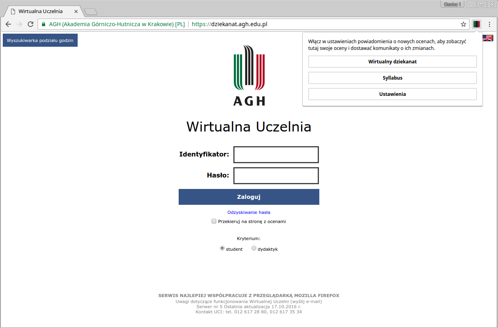
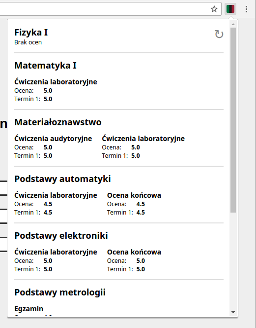
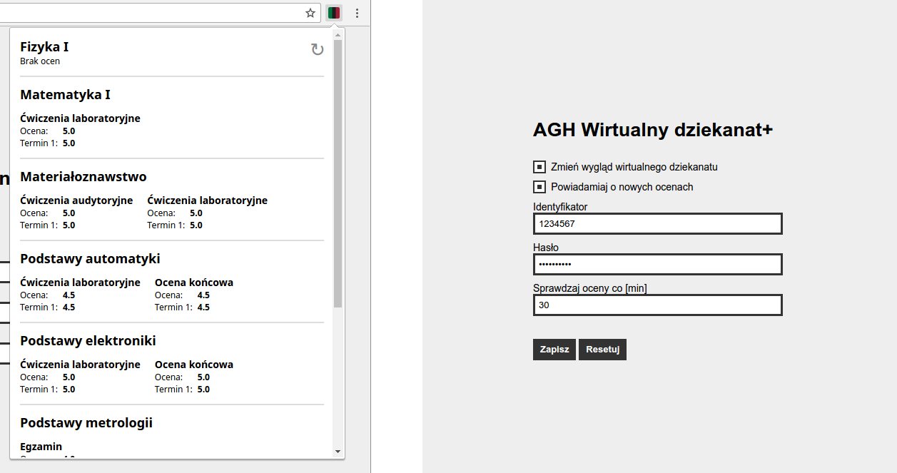

AGH Wirtualny Dziekanat+
===========

Rozszerzenie do przeglądarki Google Chrome. Zmienia wygląd wirtualnego dziekanatu AGH, umożliwia szybki podgląd ocen i powiadamia o nowych ocenach lub ich zmianach.  

**Wersja:** 0.1-alpha

Jak korzystać
----------------

Rozszerzenie nie jest jeszcze oficjalnie wydane. Aby je przetestować należy:

1. Pobrać i rozpakować repozytorium (https://bitbucket.org/rxl/agh-wirtualny-dziekanat/downloads)
2. W przeglądarce chrome wejść na stronę chrome://extensions/ i wybrać opcję 'Tryb programisty' (prawy górny róg)
3. Kliknąc na przycisk 'Wczytaj rozszerzenie bez pakietu...' i wybrać rozpakowany folder repozytorium
